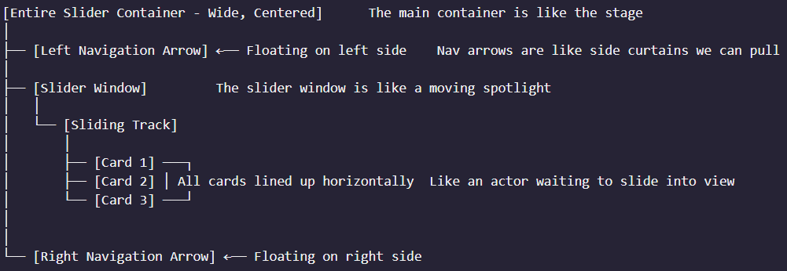

# Image Slider Component

[View Live](https://react-carousel-gamma.vercel.app/)

## Architectural Overview

### Visual Structure

When you click next/previous:

The entire "sliding track" shifts left or right
Only one card is fully visible at a time
The transition is smooth, like a gentle camera pan

The translateX property works by moving the entire card container horizontally based on the current imageIndex.

The magic happens with translateX, which literally pushes the entire track of cards horizontally, creating the illusion of navigation while keeping everything aligned and centered.

The transition property is crucial in providing the sense of direction and smoothness in the sliding animation.

-   as I introduced the state variable for active index, I removed the map, but later I decided to load all the images into the DOM at once (coz I only have 12 images) and brought back map. Also to create smooth animations you need them in the DOM already

Accessibility improvements:

-   Hover styles must be and are also applied to focus states improves accessibility, especially for users who navigate with a keyboard or assistive devices.

-   :focus applies whenever an element gains focus, regardless of how (keyboard, mouse, or programmatically).
    :focus-visible applies only when focus is obvious or expected (e.g., via keyboard Tab or screen reader, but not mouse).

Key difference: :focus-visible is better for accessibility as it avoids showing focus styles for mouse clicks.

-   aria-label to label elements for screen readers only

-   Using aria-hidden="true" on images inside icons because the label text for the button already describes the action (no need for screen reader to read the image of the icon)

-   hide hidden inactive images from screen readers using aria-hidden

-   skip link to give user a chice to skip over the controls directly jump over to some other section. The skip link is styled to be visible to only people going to tab over the elements and use screen readers

## Core Design Principles

### Sliding Mechanism

-   The entire "sliding track" shifts left or right
-   Only one card is fully visible at a time
-   Smooth transition, resembling a gentle camera pan

### Key Technical Implementations

-   `translateX` property moves the card container horizontally
-   State management tracks the current `imageIndex`
-   Transition property provides animation smoothness

## Technology Stack

-   React
-   Tailwind CSS
-   Lucide React (for icons)

## Implementation Approaches

### Approach 1: Direct Implementation

**Pros:**

-   Simplicity for small projects
-   Direct access to logic and rendering

**Cons:**

-   Code clutter in parent component
-   Limited reusability
-   Poor maintainability

### Approach 2: Dedicated Component (Recommended)

**Pros:**

-   Separation of concerns
-   High reusability
-   Modularity
-   Independent development and testing

## Technical Decisions

### State Management

-   Introduced `imageIndex` state variable
-   Initially removed `map()`, then restored to load all images
-   Decision to load all 12 images into DOM for smooth animations

### Critical CSS Properties

-   `flex-shrink-0`: Prevents card divs from collapsing
-   `object-cover`: Ensures image scaling maintains aspect ratio

## Accessibility Enhancements

### Focus and Interaction

-   Hover styles applied to focus states
-   `:focus` vs `:focus-visible` differentiation
    -   `:focus`: Applies on any focus acquisition
    -   `:focus-visible`: Applies only on keyboard/assistive device focus

### Screen Reader Optimization

-   `aria-label` for contextual labeling
-   `aria-hidden="true"` on redundant icons
-   Hide inactive images from screen readers
-   Optional skip link for navigation bypass
